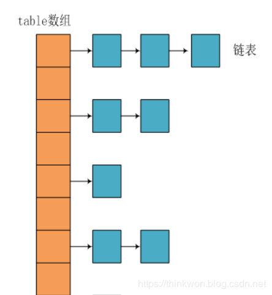
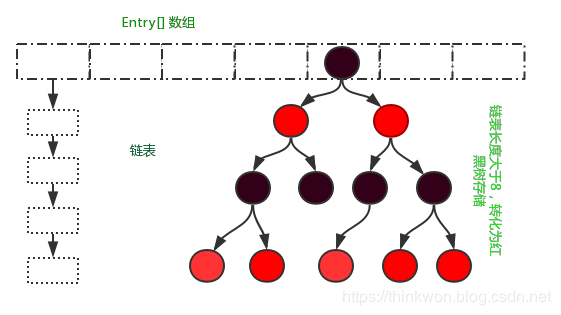
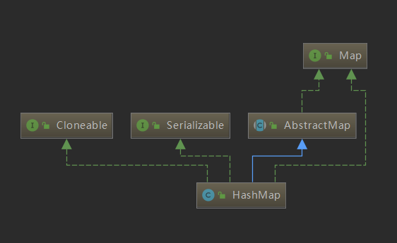

### 简介
在JDK1.8之前，HashMap采用数组+链表实现，即使用链表处理冲突，同一hash值的节点都存储在一个链表里。但是当位于一个桶中的元素较多，即hash值相等的元素较多时，通过key值依次查找的效率较低。而JDK1.8中，为了解决hash碰撞过于频繁的问题，HashMap采用数组+链表+红黑树实现，当链表长度超过阈值（8）时，将链表(查询时间复杂度为O(n))转换为红黑树(时间复杂度为O(lg n))，极大的提高了查询效率。以下没有特别说明的均为JDK1.8中的HashMap。

### 特点

HashMap 可以说是我们使用最多的 Map 集合，它有以下特点：

- 键不可重复，值可以重复
- 底层哈希表
- 线程不安全
- 允许key为null，value也可以为null

### 数据结构
在Java中，保存数据有两种比较简单的数据结构：数组和链表。数组的特点是：寻址容易，插入和删除困难；链表的特点是：寻址困难，但插入和删除容易；所以我们将数组和链表结合在一起，发挥两者各自的优势，使用一种叫做拉链法的方式可以解决哈希冲突。

#### JDK1.8之前

JDK1.8之前采用的是拉链法。拉链法：将链表和数组相结合。也就是说创建一个链表数组，数组中每一格就是一个链表。若遇到哈希冲突，则将冲突的值加到链表中即可。

#### JDK1.8之后

相比于之前的版本，jdk1.8在解决哈希冲突时有了较大的变化，当链表长度大于阈值（默认为8）时，将链表转化为红黑树，以减少搜索时间。

> 红黑树的特点：
>
> 1、是平衡二叉树：尽量保证左子树和右子树的层数是差不多的
>
> 2、最长路径不能超过最短路径的2倍；
>
> 3、每一条搜索路径中必须要保证有相同的黑色节点
>
> 4、任何一条路径中不能存在两个相同的或者连续的红色节点

#### JDK1.7 VS JDK1.8 比较

JDK1.8主要解决或优化了一下问题：

- resize 扩容优化
- 引入了红黑树，目的是避免单条链表过长而影响查询效率，红黑树算法请参考
- 解决了多线程死循环问题，但仍是非线程安全的，多线程时可能会造成数据丢失问题。

|不同|JDK 1.7|JDK 1.8|
---|---|---|
|存储结构|	数组 + 链表	数组 + 链表 + 红黑树
|初始化方式	|单独函数：inflateTable()	|直接集成到了扩容函数resize()中
|hash值计算方式	扰动处理 = 9次扰动 = 4次位运算 + 5次异或运算|	扰动处理 = 2次扰动 = 1次位运算 + 1次异或运算
|存放数据的规则|	无冲突时，存放数组；冲突时，存放链表|	无冲突时，存放数组；冲突 & 链表长度 < 8：存放单链表；冲突 & 链表长度 > 8：树化并存放红黑树
|插入数据方式|	头插法（先讲原位置的数据移到后1位，再插入数据到该位置）|	尾插法（直接插入到链表尾部/红黑树）
|扩容后存储位置的计算方式|	全部按照原来方法进行计算（即hashCode ->> 扰动函数 ->> (h&length-1)）	|按照扩容后的规律计算（即扩容后的位置=原位置 or 原位置 + 旧容量）

### 继承关系图
