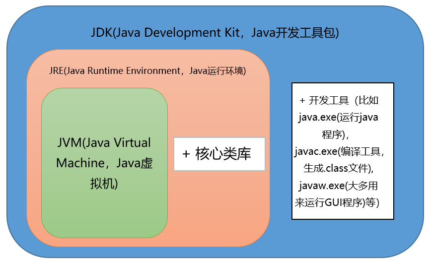

# Java简介

### Java是什么
Java是一门面向对象编程语言，不仅吸收了C++语言的各种优点，还摒弃了C++里难以理解的多继承、指针等概念，因此Java语言具有功能强大和简单易用两个特征。Java语言作为**静态面向对象编程语言**的代表，极好地实现了面向对象理论，允许程序员以优雅的思维方式进行复杂的编程 。

---

 **知识点补充**：什么是静态面向对象语言，什么是动态面向对象语言？什么是编译型语言，什么是解释型语言？
- 我们都知道一个程序的运行过程主要分为三个步骤：编译->链接->执行；
- 什么是面向对象语言，这就不多说了；
- 什么是动态语言？
    动态类型语言是指在运行期间才去做数据类型检查的语言，也就是说，在用动态类型的语言编程时，永远也不用给任何变量指定数据类型，该语言会在你第一次赋值给变量时，在内部将数据类型记录下来。Python和Ruby就是一种典型的动态类型语言，其他的各种脚本语言如VBScript也多少属于动态类型语言。
- 什么是静态语言？
    静态类型语言与动态类型语言刚好相反，它的数据类型是在编译其间检查的，也就是说在写程序时要声明所有变量的数据类型，C/C++是静态类型语言的典型代表，其他的静态类型语言还有C#、JAVA等。
- 什么是编译型语言？
    编译型语言在程序执行之前，有一个单独的编译过程，将程序翻译成机器语言，以后执行这个程序的时候，就不用再进行翻译了。例如：C/C++ 等都是编译型语言。
- 什么是解释型语言？
    解释型语言，是在运行的时候将程序翻译成机器语言，所以运行速度相对于编译型语言要慢。Java，C#等都是解释型语言。 
    虽然Java程序在运行之前也有一个编译过程，但是并不是将程序编译成机器语言，而是将它编译成字节码（可以理解为一个中间语言）。
    在运行的时候，由JVM将字节码再翻译成机器语言。
    脚本语言是一种解释性的语言，脚本语言一般都有相应的脚本引擎来解释执行。 他们一般需要解释器才能运行。JAVASCRIPT,ASP,PHP,PERL,Nuva都是脚本语言。

---
### 诞生背景

任职于Sun公司(Stanford University Network斯坦福网络公司)的詹姆斯·高斯林和麦克·舍林丹等人于1990年代初开发Java语言的雏形，最初被命名为Oak，Oak的目标是作为家用电器等小型系统的编程语言，用于电视机、电话、闹钟、烤面包机等家用电器的控制和通信。由于这些智能化家电的市场需求没有预期的高，Sun公司放弃了该项计划。随着1990年代互联网的发展，Sun公司发现Oak在互联网上应用的前景，于是改造了Oak，于1995年5月以Java的名称正式发布。伴随着互联网的迅猛发展，Java逐渐成为重要的网络编程语言。

### 三大版本
#### Java SE（J2SE，Java 2 Platform Standard Edition，标准版）
Java SE 以前称为 J2SE。它允许开发和部署在桌面、服务器、嵌入式环境和实时环境中使用的 Java 应用程序。Java SE 包含了支持 Java Web 服务开发的类，并为Java EE和Java ME提供基础。
#### Java EE（J2EE，Java 2 Platform Enterprise Edition，企业版）
Java EE 以前称为 J2EE。企业版本帮助开发和部署可移植、健壮、可伸缩且安全的服务器端Java 应用程序。Java EE 是在 Java SE 的基础上构建的，它提供 Web 服务、组件模型、管理和通信 API，可以用来实现企业级的面向服务体系结构（service-oriented architecture，SOA）和 Web2.0应用程序。2018年2月，Eclipse 宣布正式将 JavaEE 更名为 JakartaEE
#### Java ME（J2ME，Java 2 Platform Micro Edition，微型版）
Java ME 以前称为 J2ME。Java ME 为在移动设备和嵌入式设备（比如手机、PDA、电视机顶盒和打印机）上运行的应用程序提供一个健壮且灵活的环境。Java ME 包括灵活的用户界面、健壮的安全模型、许多内置的网络协议以及对可以动态下载的连网和离线应用程序的丰富支持。基于 Java ME 规范的应用程序只需编写一次，就可以用于许多设备，而且可以利用每个设备的本机功能。

### 语言特点与应用场景
Java语言具有简单性、面向对象、分布式、健壮性、安全性、跨平台性、可移植性、多线程与动态性等特点。Java语言可以编写桌面应用程序、Web应用程序、分布式系统和嵌入式系统等 。Java 快速、安全、可靠。从笔记本电脑到数据中心，从游戏控制台到超级计算机，从手机到互联网，Java 无处不在！

### Java技术体系

### JVM、JRE和JDK的关系
**JVM**
Java Virtual Machine是Java虚拟机，Java程序需要运行在虚拟机上，不同的平台有自己的虚拟机，因此Java语言可以实现跨平台。

**JRE**
Java Runtime Environment包括Java虚拟机和Java程序所需的核心类库等。核心类库主要是java.lang包：包含了运行Java程序必不可少的系统类，如基本数据类型、基本数学函数、字符串处理、线程、异常处理类等，系统缺省加载这个包

如果想要运行一个开发好的Java程序，计算机中只需要安装JRE即可。

**JDK**
Java Development Kit是提供给Java开发人员使用的，其中包含了Java的开发工具，也包括了JRE。所以安装了JDK，就无需再单独安装JRE了。其中的开发工具：编译工具(javac.exe)，打包工具(jar.exe)等

##### JVM&JRE&JDK关系图

### JDK安装及环境变量配置
在官网下载需要的版本安装即可
> 注意：下载jdk，安装的时候，会弹出继续安装jre的框，实际上jdk中已经包含了jre，所以直接X掉就行，不用安装

**环境变量详解**

**JAVA_HOME**  
变量名：JAVA_HOME  
变量值：C:\develop\Java\jdk1.8.0_191  
用途：定义一个变量，供其他地方使用  

**Path**  
变量名：Path  
变量值：%JAVA_HOME%\bin;%JAVA_HOME%\jre\bin;  
用途：让系统在任何路径下都可以识别java、javac、javap等命令 

**CLASSPATH**  
变量名：CLASSPATH  
变量值：.;%JAVA_HOME%\lib\dt.jar;%JAVA_HOME%\lib\tools.jar  
用途：告诉jvm要使用或执行的class放在什么路径上，便于JVM加载class文件，.;表示当前路径，tools.jar和dt.jar为类库路径 

###### CLASSPATH详解
**tools.jar**  
工具类库(编译和运行等)，它跟我们程序中用到的基础类库没有关系。我们注意到在Path中变量值bin目录下的各个exe工具的大小都很小，一般都在27KB左右，这是因为它们实际上仅仅相当于是一层代码的包装，这些工具的实现所要用到的类库都在tools.jar中，用压缩软件打开tools.jar，你会发现有很多文件是和bin目录下的exe工具相对性的。当然，如果tools.jar的功能只有这些的话，那么我们根本不用把它加入到CLASSPATH变量中，因为bin目录下的工具自己可以完成对这些类库的调用，因此tools.jar应该还有其他的功能。在里面还可以看到有Applet和RMI等相关的文件，因此tools.jar应该还是远程调用等必须的jar包。tools.jar的其他作用可以查看其他资料。

**dt.jar**  
运行环境类库，主要是Swing包，这一点通过用压缩软件打开dt.jar也可以看到。如果在开发时候没有用到Swing包，那么可以不用将dt.jar添加到CLASSPATH变量中。
CLASSPATH中的类库是由Application ClassLoader或者我们自定义的类加载器来加载的，这里当然不能包括基础类库，如果包括基础类库的话，并用两个不同的自定义类加载器去加载该基础类，那它得到的该基础类就不是唯一的了，这样便不能保证Java类的安全性。

**基本类库和扩展类库rt.jar**  
基本类库是所有的 import java.* 开头的类，在 %JAVA_HOME%\jre\lib 目录下（如其中的 rt.jar、resource.jar ），类加载机制提到，该目录下的类会由 Bootstrap ClassLoader 自动加载，并通过亲委派模型保证了基础类库只会被Bootstrap ClassLoader加载，这也就保证了基础类的唯一性。

**扩展类库是所有的 import javax.* 开头的类**，在 %JAVA_HOME%\jre\lib\ext 目录下，该目录下的类是由Extension ClassLoader 自动加载，不需要我们指定。

rt.jar 默认就在根ClassLoader的加载路径里面，放在CLASSPATH也是多此一举。

### Java访问修饰符

定义
Java中，可以使用访问修饰符来保护对类、变量、方法和构造方法的访问。Java 支持 4 种不同的访问权限。
分类
private : 在同一类内可见。使用对象：变量、方法。 注意：不能修饰类（外部类）
default (即缺省，什么也不写，不使用任何关键字）: 在同一包内可见，不使用任何修饰符。使用对象：类、接口、变量、方法。
protected : 对同一包内的类和所有子类可见。使用对象：变量、方法。 注意：不能修饰类（外部类）。
public : 对所有类可见。使用对象：类、接口、变量、方法