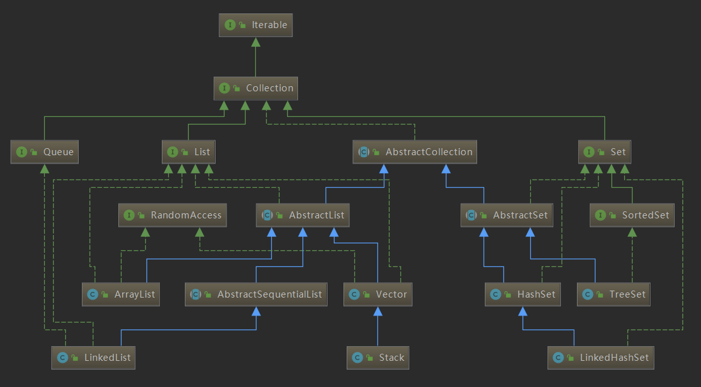
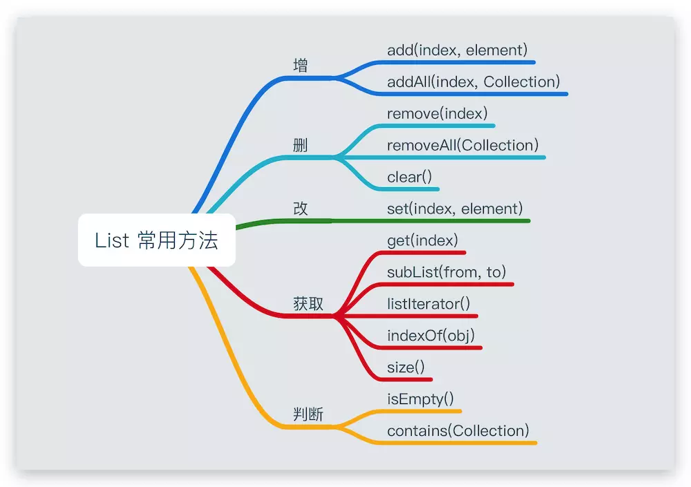
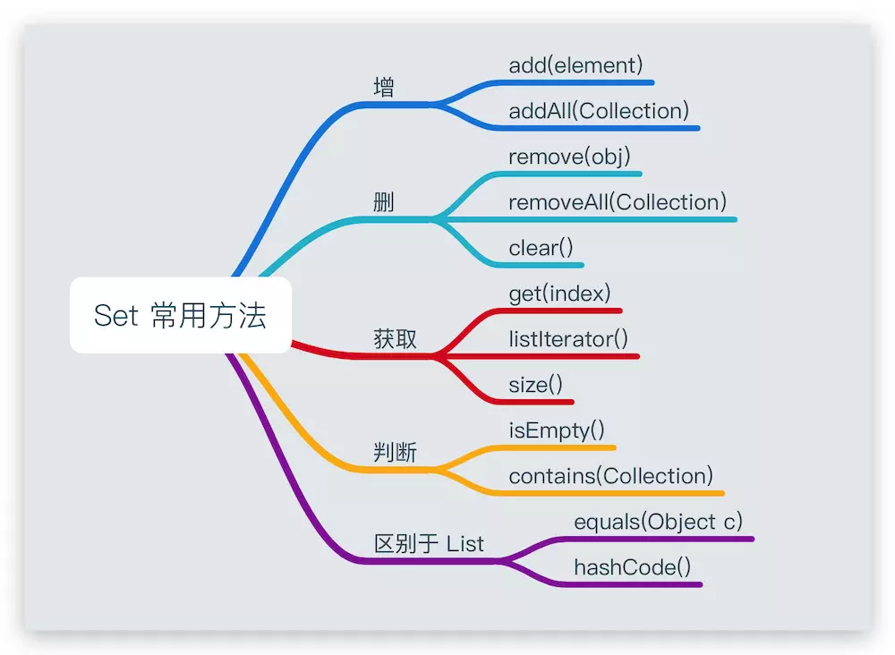

#### 名词解释

##### 集合框架： 用于存储数据的容器

集合框架是为表示和操作集合而规定的一种统一的标准的体系结构。
任何集合框架都包含三大块内容：对外的接口、接口的实现和对集合运算的算法。

**接口：** 表示集合的抽象数据类型。接口允许我们操作集合时不必关注具体实现，从而达到“多态”。在面向对象编程语言中，接口通常用来形成规范。

**实现：**集合接口的具体实现，是重用性很高的数据结构。

**算法：**在一个实现了某个集合框架中的接口的对象身上完成某种有用的计算的方法，例如查找、排序等。这些算法通常是多态的，因为相同的方法可以在同一个接口被多个类实现时有不同的表现。事实上，算法是可复用的函数。
它减少了程序设计的辛劳。

集合框架通过提供有用的数据结构和算法使你能集中注意力于你的程序的重要部分上，而不是为了让程序能正常运转而将注意力于低层设计上。
通过这些在无关API之间的简易的互用性，使你免除了为改编对象或转换代码以便联合这些API而去写大量的代码。 它提高了程序速度和质量。

#### 特点
- 对象封装数据，对象多了也需要存储。集合用于存储对象。

- 对象的个数确定可以使用数组，对象的个数不确定的可以用集合。因为集合是可变长度的。

##### 集合和数组的区别

- 数组是固定长度的；集合可变长度的。

- 数组可以存储基本数据类型，也可以存储引用数据类型；集合只能存储引用数据类型。

- 数组存储的元素必须是同一个数据类型；集合存储的对象可以是不同数据类型。

注意：集合只能存基本数据类型

```
ArrayList lst =new  ArrayList(10);
lst.add("Java入门到精通");
lst.add(true);  //注意：这里的true是Boolean 不是基本数据类型
lst.add(12);//这里的12也不是基本数据类型，Integer
lst.add(3.14);  //这里的类型也不是基本数据类型 ，是Float
```
另外，当一直add，超过10个的时候就会自动扩容


##### 数据结构：就是容器中存储数据的方式。

对于集合容器，有很多种。因为每一个容器的自身特点不同，其实原理在于每个容器的内部数据结构不同。

集合容器在不断向上抽取过程中，出现了集合体系。在使用一个体系的原则：参阅顶层内容。建立底层对象。

##### 使用集合框架的好处
- 容量自增长；
- 提供了高性能的数据结构和算法，使编码更轻松，提高了程序速度和质量；
- 允许不同 API 之间的互操作，API之间可以来回传递集合；
- 可以方便地扩展或改写集合，提高代码复用性和可操作性。
- 通过使用JDK自带的集合类，可以降低代码维护和学习新API成本。


#### Iterator接口

Iterator接口，用于遍历集合元素的接口。

在Iterator接口中定义了三个方法：

修饰与类型 | 方法与描述方法与描述  | 备注
---|---|---
boolean | hasNext() 如果仍有元素可以迭代，则返回true。 |
E | next() 返回迭代的下一个元素。 |
void | remove() 从迭代器指向的 collection 中移除迭代器返回的最后一个元素（可选操作）。 |


每一个集合都有自己的数据结构(就是容器中存储数据的方式)，都有特定的取出自己内部元素的方式。为了便于操作所有的容器，取出元素。将容器内部的取出方式按照一个统一的规则向外提供，这个规则就是Iterator接口，使得对容器的遍历操作与其具体的底层实现相隔离，达到解耦的效果。

也就说，只要通过该接口就可以取出Collection集合中的元素，至于每一个具体的容器依据自己的数据结构，如何实现的具体取出细节，这个不用关心，这样就降低了取出元素和具体集合的耦合性。

使用迭代器遍历集合元素
```Java
public static void main(String[] args) {
    List<String> list1 = new ArrayList<>();
    list1.add("abc0");
    list1.add("abc1");
    list1.add("abc2");

    // while循环方式遍历
    Iterator it1 = list1.iterator();
    while (it1.hasNext()) {
        System.out.println(it1.next());
    }

    // for循环方式遍历
    for (Iterator it2 = list1.iterator(); it2.hasNext(); ) {
        System.out.println(it2.next());
    }

}


```
使用Iterator迭代器进行删除集合元素，则不会出现并发修改异常。

因为：在执行remove操作时，同样先执行checkForComodification()，然后会执行ArrayList的remove()方法，该方法会将modCount值加1，这里我们将expectedModCount=modCount，使之保持统一。


##### ListIterator接口

ListIterator是一个功能更加强大的迭代器， 它继承于Iterator接口，只能用于各种List类型的访问。可以通过调用listIterator()方法产生一个指向List开始处的ListIterator， 还可以调用listIterator(n)方法创建一个一开始就指向列表索引为n的元素处的ListIterator。

###### 特点

- 允许我们向前、向后两个方向遍历 List；
- 在遍历时修改 List 的元素；
- 遍历时获取迭代器当前游标所在位置。

###### 常用API
修饰与类型 |方 法与描述 |
---|---|---
void|add(E e) 将指定的元素插入到列表 （可选操作）。
boolean|	hasNext() 如果此列表迭代器在前进方向还有更多的元素时，返回 true。
boolean|	hasPrevious() 如果此列表迭代器在相反方向还有更多的元素时，返回 true。
E	|next() 返回列表中的下一个元素和光标的位置向后推进。
int |	nextIndex() 返回调用 next()后返回的元素索引。
E	|previous() 返回列表中的上一个元素和光标的位置向前移动。
int|	previousIndex() 返回调用previous() 后返回的元素索引 。
void|	remove() 删除列表中调用next()或previous()的返回最后一个元素。
void|	set(E e) 用指定元素替换列表中调用next()或previous()的返回最后一个元素。

##### Collection接口

所有集合类都位于java.util包下。Java的集合类主要由两个接口派生而出：Collection和Map，Collection和Map是Java集合框架的根接口，这两个接口又包含了一些子接口或实现类。

Collection一次存一个元素，是单列集合；

Map一次存一对元素，是双列集合。Map存储的一对元素：键–值，键（key）与值(value)间有对应(映射)关系。

**单列集合继承关系图**



###### Collection集合主要有List和Set两大接口
List、Set集成于Collection

List：有序(元素存入集合的顺序和取出的顺序一致)，元素都有索引。元素可以重复。可以自动扩容

Set：无序(存入和取出顺序有可能不一致)，不可以存储重复元素。必须保证元素唯一性。

###### List集合
List是元素有序并且可以重复的集合。

List的主要实现：ArrayList， LinkedList， Vector。

**List常用方法List**


###### ArrayList、LinkedList、Vector 的区别

| |ArrayList|	LinkedList|	Vector
|---|---|---|---|
底层实现|	数组|	双向链表|	数组
同步性及效率|	不同步，非线程安全，效率高，支持随机访问|	不同步，非线程安全，效率高	|同步，线程安全，效率低
特点|	查询快，增删慢|	查询慢，增删快|	查询快，增删慢
默认容量|	10	|/|	10
扩容机制|	int newCapacity = oldCapacity + (oldCapacity >> 1)；//1.5 倍|	/|	2 倍


> 总结：
ArrayList 和 Vector 基于数组实现，对于随机访问get和set，ArrayList优于LinkedList，因为LinkedList要移动指针。

- LinkedList 不会出现扩容的问题，所以比较适合随机位置增、删。但是其基于链表实现，所以在定位时需要线性扫描，效率比较低。
- 当操作是在一列数据的后面添加数据而不是在前面或中间，并且需要随机地访问其中的元素时，使用ArrayList会提供比较好的性能；
- 当你的操作是在一列数据的前面或中间添加或删除数据，并且按照顺序访问其中的元素时，就应该使用LinkedList了。

ArrayList的add方法源码：add在没有指定下标index的时候，是在数组的第size++的位置添加元素

```Java 
    /**
     * Appends the specified element to the end of this list.
     *
     * @param e element to be appended to this list
     * @return <tt>true</tt> (as specified by {@link Collection#add})
     */
    public boolean add(E e) {
        ensureCapacityInternal(size + 1);  // Increments modCount!!
        elementData[size++] = e;
        return true;
    }
```

###### 遍历时操作元素
遍历集合时，同时操作集合中的元素（增删等）

```
/**
  * Description: for循环遍历
  * 输出结果：
  * [a, b, c, d, e]
  * 由结果可知，第二个元素b并未删除，原因是当第一个元素b被删除后，它后面所有的元素都向前移动了一个单位，循环时导致第二个元素b漏掉了
  */
public static void remove(List<String> list) {
    for (int i = 0; i < list.size(); i++) {
        String s = list.get(i);
        if (s.equals("b")) {
            list.remove(s);
        }
    }
}

/**
  * Description: foreach循环遍历
  *
  * 会报错：java.util.ConcurrentModificationException。这是因为在这里，foreach循环遍历容器本质上是使用迭代器进行遍历的，会对修改次数modCount进行检查，不允许集合进行更改操作
     */
public static void remove2(List<String> list) {
    for (String s : list) {
        if (s.equals("b")) {
            list.remove(s);
        }
        System.out.println(s);
    }
}

/**
  * Description: 使用迭代器遍历
  */
public static void remove3(List<String> list) {
    Iterator<String> it = list.iterator();
    while (it.hasNext()) {
        String s = it.next();
        if (s.equals("b")) {
            it.remove();
        }
    }
}

```

使用迭代器遍历删除时，能够避免方法二中出现的问题。这是因为：在ArrayList中，modCount是指集合的修改次数，当进行add或者delete时，modCount会+1；expectedModCount是指集合的迭代器的版本号，初始值是modCount，但是当集合进行add或者delete操作时，modCount会+1，而expectedModCount不会改变，所以方法二中会抛出异常。但是it.remove操作时，会同步expectedModCount的值，把modCount的值赋予expectedModCount。所以不会抛出异常。

总结：如果想正确的循环遍历删除（增加）元素，需要使用方法三，也就是迭代器遍历删除（增加）的方法。

##### Set集合

Set集合元素无序(存入和取出的顺序不一定一致)，并且没有重复对象。
Set的主要实现类：HashSet， TreeSet。

Set常用方法



HashSet、TreeSet、LinkedHashSet的区别
| |HashSet|	TreeSet|	LinkedHashSet|
|---|---|---|---|
底层实现|	HashMap|	红黑树|	LinkedHashMap
重复性|	不允许重复|	不允许重复	|不允许重复
有无序|	无序|	有序，支持两种排序方式，自然排序和定制排序，其中自然排序为默认的排序方式。	|有序，以元素插入的顺序来维护集合的链接表
时间复杂度|	add()，remove()，contains()方法的时间复杂度是O(1)	|add()，remove()，contains()方法的时间复杂度是O(logn)|	LinkedHashSet在迭代访问Set中的全部元素时，性能比HashSet好，但是插入时性能稍微逊色于HashSet，时间复杂度是 O(1)。
同步性|	不同步，线程不安全|	不同步，线程不安全|	不同步，线程不安全
null值	|允许null值	|不支持null值，会抛出 java.lang.NullPointerException 异常。因为TreeSet应用 compareTo() 方法于各个元素来比较他们，当比较null值时会抛出 NullPointerException异常。	|允许null值
比较|	equals()|	compareTo()|	equals()


##### HashSet如何检查重复

当你把对象加入HashSet时，HashSet会先计算对象的hashcode值来判断对象加入的位置，同时也会与其他加入的对象的hashcode值作比较，如果没有相符的hashcode，HashSet会假设对象没有重复出现。但是如果发现有相同hashcode值的对象，这时会调用equals()方法来检查hashcode相等的对象是否真的相同。如果两者相同，HashSet就不会让加入操作成功。

hashCode()与equals()的相关规定：
- 如果两个对象相等，则hashcode一定也是相同的
- 两个对象相等，equals方法返回true
- 两个对象有相同的hashcode值，它们也不一定是相等的
- 综上，equals方法被覆盖过，则hashCode方法也必须被覆盖
- hashCode()的默认行为是对堆上的对象产生独特值。如果没有重写hashCode()，则该class的两个对象无论如何都不会相等（即使这两个对象指向相同的数据）。

总结：
HashSet是一个通用功能的Set，而LinkedHashSet 提供元素插入顺序保证，TreeSet是一个SortedSet实现，由Comparator 或者 Comparable指定的元素顺序存储元素。


##### Map接口

Map 是一种把键对象和值对象映射的集合，它的每一个元素都包含一对键对象和值对象。 Map没有继承于Collection接口，从Map集合中检索元素时，只要给出键对象，就会返回对应的值对象。

Map 的常用实现类：HashMap、TreeMap、HashTable、LinkedHashMap、ConcurrentHashMap

